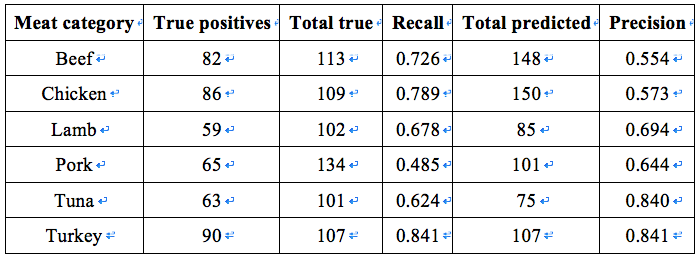

# Food Recognition Using Convolutional Neural Network for Estimating Carbon Footprint

The increase of greenhouse gases (GHG) has led to the climate change and the global warm. Carbon dioxide is the primary GHG emitted through human activities such as consumption of food, transportation, burning fuels and other services. The concept of low-carbon society is thus proposed as an environmental protection measure. One source of carbon emission is the agriculture and food, especially meat consumption. GHG emissions in meat-eaters are approximately twice as high as those in vegans. Nowadays, many people follow the “camera eats first” phenomenon, where people take photos of their meals before eating. One of the potential approaches to reduce GHG is to build a mobile application that captures the food pictures and analyzes the meat information automatically to inform users the carbon footprint from their daily meat consumption. 

## Project Introduction

In the project, new dataset of cooked meat image was collected and used for the experiments on meat categorization. Several CNN models are trained and fine-tuned on the dataset, among which the best model was selected for carbon footprint estimation. The experimental results of applying the best CNN model to the test dataset have demonstrated the effectiveness of this solution and the feasibility to develop a practical mobile application with trained CNN model for food carbon footprint estimation.

## Methods

- Data augmentation

Data augmentation is introduced to generate more data according to the existing ones by a series of processes such as rotation and flipping. Here is an example.

- CNN model

I built a simple CNN model with 4 hidden layers including 3 convolutional-pooling layers and a fully connected layer except for the input layer and the output layer.

- Transfer learning

Firstly, the pre-trained model Xception was loaded with the top layer removed and replaced by a new softmax activated layer to output the probability distribution over class labels. The parameters of all layers were trained because the dataset of meat images seemed very different from the ImageNet. Then I did similar job on VGG and InceptionV3 model. Another experiment was implemented by training the last four layers in VGG model and adding a full-connected layer.

- Carbon footprint estimation

The GHG produced per kilogram of each food include all emissions from both the production stage (at farm gate) and consumption stage (post farm gate). 

## Experiments

- Dataset description

Raw images were scraped from Google Image by the keyword “cooked AND meat name” for 6 categories.

- Model comparison

All the best performances of each fine-tuned model were achieved within 30 epochs.

- Mode Evaluation 

The precision and recall of one category are affected by other categories in a multi-classification problem. From the system’s perspective, the categorical accuracy in the model training in Keras is actually the recall metric as the number of true positives are divided by the actual number of images in one meat category; in practice, users concern more about the precision metric as they upload a bunch of images to see how many predicted results are correct. Thus it is necessary to analyze both the precision and recall metrics.

- Carbon footprint estimation

When users upload a picture, the system first recognizes the image and decides the category of meat. Carbon emission is then calculated as shown in the table. The weight in the table is a default value and users can adjust it manually in a practical application.

## Conclusion

A system of food carbon footprint estimation comprises four steps: image retrieval, food recognition, volume estimation and carbon footprint calculation. I mainly studied the second step of recognizing different types of meat in the project. A small dataset of meat images collected from the Internet was used to train and evaluate the models. Data augmentation alleviates the problem of limited size of the dataset and increases the data diversity. One simple CNN model and some pre-trained models were trained on the dataset. The best model that fine-tuned the Inception model reaches an overall precision of 69.10% and recall of 69.05% on meat categorization. The weights of the best model have a small size of around 90 MB, which is practical to be loaded in an application. 
In conclusion, the project provides a basic model of designing an application for food carbon footprint estimation in the hope of arousing people’s awareness of environmental protection from the trivial.
